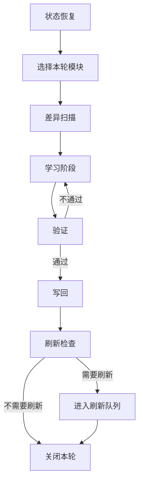

# workflow-spec

> 最近确认时间：2026-04-16

## 1. 目标

`workflow-spec` 定义一次标准学习循环怎么跑。
它关心顺序、门槛、产物和回退点，重点是把“学习阶段、教学阶段、状态恢复、验证、写回、刷新”闭环化。

## 2. 标准流程

## 3. 阶段定义

### 3.1 状态恢复

恢复阶段要解决四个问题：

- 我现在在哪个项目里
- 我上次学到哪个模块
- 哪些结论已经写回
- 哪些问题还没解决

### 3.2 学习阶段

学习阶段分三种动作：

1. 获取概念。
2. 压缩成自己的理解。
3. 生成可验证的例子或判断。

如果当前是教学型模块，学习阶段内部继续展开为：

`讲解 -> 理解确认 -> 掌握验证 -> 费曼/实操`

### 3.2A 差异扫描阶段

差异扫描阶段要回答四个问题：

- 这个模块所在方向最近是否出现了新概念、新术语或新默认做法
- 现有 `concepts.md` 或 `teaching-guide.md` 是否把旧快照讲成了当前事实
- 行业内是否出现了新的架构分层、工具边界或 SOP
- 本轮需要先补哪些外部来源，才能继续稳定教学

差异扫描不是要求每次都重做全量研究，而是做一轮有边界的当前性检查。
如果模块明显属于快速变化领域，应默认先做。

### 3.3 验证阶段

验证阶段检查：

- 解释是否自洽
- 结论是否与来源一致
- 例子是否误导
- 时效项是否过期
- 是否值得写回长期文档

教学型模块还要检查：

- 讲解轮次是否达标
- 错误次数是否触发回退
- 是否已经给出错误归因
- 是否已经形成下次复习计划

### 3.4 写回阶段

写回阶段只处理三类内容：

- 稳定概念
- 已确认结论
- 下一步行动

### 3.5 刷新阶段

刷新阶段处理两类东西：

- 快速变化的外部事实
- 被验证为过时的旧结论

## 4. 决策规则

- 如果恢复不完整，先恢复，不直接学习。
- 如果模块明显依赖快速变化生态，先做差异扫描，再开始正式讲解。
- 如果验证失败，回到学习阶段修正。
- 如果事实时效不确定，标记为 volatile。
- 如果内容只能短期成立，不写进 stable 区。
- 如果没有长期价值，不写回正式文档。
- 如果差异扫描发现新概念、新 SOP 或旧说法失效，先更新 `sources.md / volatile.md / refresh-queue.md`，再继续教学。

## 5. 每轮产物

每轮学习结束时，至少要留下：

- 本轮学到什么
- 哪些结论已验证
- 哪些地方还不确定
- 差异扫描发现了什么
- 哪些内容已写回
- 哪些内容需要刷新
- 下轮从哪里继续

## 6. 典型分支

### 6.1 新项目启动

先恢复项目定位，再选第一个模块，再写入初始状态和边界。

### 6.2 断点续学

先读 `handover` 和 `state`，再恢复到最近一个未完成模块，不能默认从头开始。

### 6.3 事实更新

如果模块里有模型、产品、标准、案例等容易过时内容，先进入刷新再写回。

### 6.3A 学习中途补查

如果在讲解过程中发现：

- 用户问到课程稿里没有覆盖的新概念
- 当前官方资料已经改变默认做法
- 旧讲稿里的例子、术语或 SOP 已经漂移

则允许中途暂停讲解，先做差异扫描，再决定是：

- 回到 stable 概念继续讲
- 把新内容写入 `volatile`
- 把它升级成新的模块或案例

### 6.4 验证失败

如果理解不稳定或来源冲突，保留问题，不硬写结论。

### 6.5 教学回退

如果正式验证或实操超过阈值，必须回到讲解阶段，而不是继续堆题。

## 7. 与宿主的关系

workflow 只定义顺序和门槛，不定义宿主如何点击、如何调用工具、如何保存文件。
这些都属于 adapter。
具体怎么讲、怎么卡、怎么复习，则由 `Teaching-Contract` 定义。
