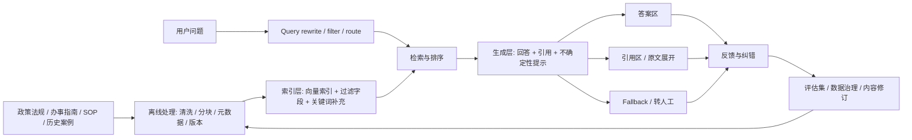

# Knowledge Architecture Map

> 最近确认时间：2026-04-16
> 目标：说明 data layer、answer layer 和 trust layer 的分工

## 架构图

## 分层说明

### Data Layer

- 文档清洗
- 分块
- 元数据补充
- 版本管理
- 索引构建

### Answer Layer

- query rewrite
- retrieval
- ranking
- grounded answer generation

### Trust Layer

- citations
- 版本提示
- 不确定性提示
- fallback
- 人工接管

## 关键设计点

- 政策法规按章节/条款切分
- SOP 优先保持流程完整
- 案例库保留案例编号、时间和适用范围
- 检索结果必须带来源字段，不能只返回拼接文本

## 观测点

- 没检到
- 检到了但不对口
- 检到了且对口，但总结错了
- 引用不完整
- 高风险问题未触发接管
