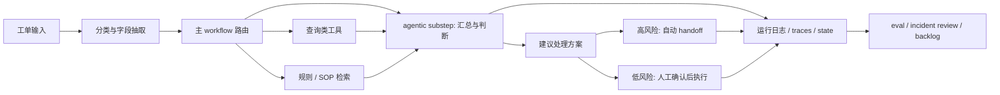

# Workflow Architecture Map

> 最近确认时间：2026-04-16
> 目标：说明 workflow、agentic step、handoff 和 observability 的结构

## 层次

### Workflow Layer

- 工单分类
- 路由
- 权限与审批边界

### Agentic Layer

- 摘要
- 多来源信息整合
- 例外判断

### Safety Layer

- 高风险动作拦截
- 人工接管
- 证据打包

### Runtime Layer

- state
- traces
- error taxonomy
- replay / recovery
