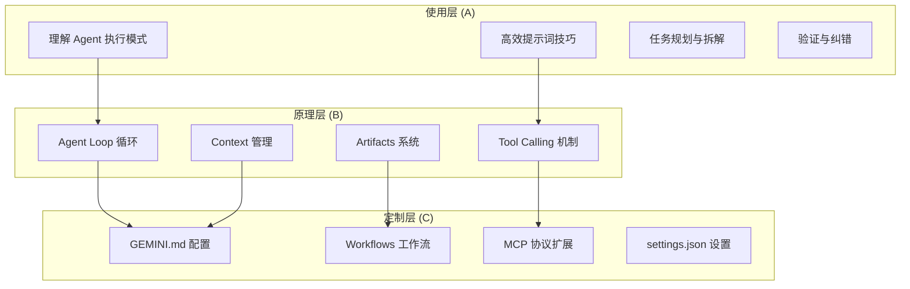

# Antigravity 全景导论

> **项目**：Antigravity_Mastery
> **生成日期**：2026-01-10
> **范围**：使用层 + 原理层 + 定制层

---

## 🤔 什么是 Antigravity？

**Antigravity** 是 Google DeepMind 开发的 AI 编码平台，代表了软件开发范式的根本性转变——从传统 IDE（集成开发环境）到 **Agent-First（代理优先）** 架构。

> **核心定义**：Antigravity 不是一个"更聪明的编辑器"，而是一个**开发者指挥 AI Agent 执行任务的调度中心**。开发者的角色从"写代码的人"升级为"指挥架构师"。

**关键区分**：
- **传统 IDE**：人写代码，AI 辅助补全（Copilot 模式）
- **Antigravity**：人定义目标，AI Agent 自主规划执行（Orchestrator 模式）

---

## 🏛️ Antigravity 三大支柱

Antigravity 的架构建立在三个核心组件之上：

### 1. Agent Manager（代理管理器）

**是什么**：集中式的 AI Agent 控制中心。

**能做什么**：
- 创建、管理、编排多个 AI Agent
- 跨项目、跨工作空间调度任务
- 分配高级目标，监控执行进度

**类比**：像一个"项目经理"，你不需要亲自写每一行代码，而是给 Agent 下达任务，它们自主完成并汇报。

### 2. Editor（代码编辑器）

**是什么**：功能完整的代码编辑器。

**能做什么**：
- 常规代码编辑、语法高亮、调试
- AI 增强功能（内联补全、重构建议）
- 与 Agent 的任务上下文无缝集成

### 3. Browser（内置浏览器）

**是什么**：集成浏览器，内嵌独立的 AI Agent。

**能做什么**：
- 浏览网页、执行测试、研究资料
- AI Agent 可以模拟用户操作（点击、滚动、填写表单）
- 截图、录制浏览过程作为验证证据

---

## 🧠 Antigravity 背后的模型

| 模型 | 用途 |
|-----|------|
| **Gemini 3 Pro** | 核心推理、工具调用、Agentic Coding |
| **Gemini 2.5 Computer Use** | 浏览器 Agent 控制、屏幕理解 |
| **Nano Banana** | 图像编辑任务 |

**关键能力**：
- **Reasoning（推理）**：拆解复杂任务、规划执行步骤
- **Tool Use（工具调用）**：调用文件系统、终端、浏览器等外部工具
- **Structured Output（结构化输出）**：生成 JSON、代码块等可解析的输出

---

## 📦 核心概念速览

| 概念 | 定义 | 为什么重要 |
|-----|------|-----------|
| **Agent Loop** | AI Agent 的"感知-思考-行动"循环（ReAct Loop） | 理解 Agent 如何自主工作 |
| **Tool Calling** | Agent 调用外部工具（读写文件、执行命令、浏览网页） | 让 AI 从"只能说"变成"能做事" |
| **Artifacts** | 任务执行的有形交付物（任务清单、实现计划、截图、录屏） | 让执行过程可追溯、可验证 |
| **GEMINI.md** | 项目级配置文件，定义 AI 的行为准则和人格 | 定制 AI 行为的核心杠杆 |
| **MCP (Model Context Protocol)** | 模型上下文协议，AI 与外部系统的标准化通信协议 | 扩展 AI 能力边界 |
| **Workflows** | 预定义的任务流程模板 | 自动化重复性任务 |
| **Task Boundary** | 任务边界，标记任务的开始、进度、结束 | 让用户了解 Agent 在做什么 |
| **Context Window** | 上下文窗口，Agent 能"记住"的信息量 | 理解 Agent 的"遗忘"机制 |

---

## 🗺️ 知识地图

**学习顺序建议**：
1. **使用层 (A)**：先学会用，建立直觉
2. **原理层 (B)**：理解为什么，解开黑盒
3. **定制层 (C)**：按需定制，变成你自己的工具

---

## ⚠️ 常见误区 / 直觉陷阱

### 陷阱1：以为 Agent 是"超级搜索引擎"

**错误**：把 Antigravity 当成一个更聪明的 Google，只问问题等答案。

**真相**：Agent 的核心能力是**执行任务**，而不是回答问题。它能读写文件、运行代码、操作浏览器——不是"告诉你答案"，而是"帮你做事"。

### 陷阱2：以为 Context 无限大

**错误**：把整个项目代码库塞给 Agent，期望它"全知全能"。

**真相**：Context Window 有上限（即使很大）。超过限制后，早期信息会被"遗忘"。正确做法是**精准喂料**，而不是"越多越好"。

### 陷阱3：以为 Agent 不会犯错

**错误**：Agent 输出的代码直接复制粘贴，不验证就上线。

**真相**：Agent 会犯错、会幻觉（Hallucination）、会理解偏差。**验证是必须的**——这就是为什么 Artifacts 和 Task Boundary 存在。

### 陷阱4：以为 GEMINI.md 只是"说明书"

**错误**：把 GEMINI.md 当成普通的文档，只写项目描述。

**真相**：GEMINI.md 是 **AI 的行为塑造器**。你可以定义它的人格、限制它的行为、指定它的工作流程。这是"定制层"的核心杠杆。

---

## 📚 学习路径预告

根据你选择的"全部三层"，我规划了以下学习路径：

### Phase A：使用层（4节点）
1. **A1. Agent 执行模式**：理解 Antigravity 如何接收任务、拆解、执行
2. **A2. 提示词艺术** 🚧：高效沟通的技巧（直接影响执行质量）
3. **A3. 任务规划**：如何拆解复杂任务，让 Agent 更好完成
4. **A4. 验证与纠错**：如何审核 Agent 成果，发现并修复错误

### Phase B：原理层（4节点）
5. **B1. Agent Loop** 🚧：感知-思考-行动循环的内部机制
6. **B2. Tool Calling**：Agent 如何调用外部工具
7. **B3. Context 管理**：上下文窗口、Token 限制、记忆策略
8. **B4. Artifacts 系统**：任务边界、实现计划、验证证据

### Phase C：定制层（4节点）
9. **C1. GEMINI.md 配置**：项目级配置、层级结构、常用字段
10. **C2. Workflows 工作流**：预定义流程、自动化指令
11. **C3. MCP 协议** 🚧：扩展 Agent 能力、连接外部系统
12. **C4. settings.json**：全局设置、工具权限、安全边界

🚧 = 门槛概念（需要重点掌握）

---

## 📖 延伸阅读

- **官方文档**：[Antigravity Official](https://antigravity.google)
- **Gemini CLI GitHub**：[github.com/google-gemini/gemini-cli](https://github.com/google-gemini/gemini-cli)
- **MCP 协议规范**：[modelcontextprotocol.io](https://modelcontextprotocol.io)
- **Google DeepMind Blog**：Antigravity 发布公告

---

## 💭 预留思考题

在正式开始前，先思考以下问题（不需要立刻回答，后续学习中会逐步解开）：

1. **如果 Agent 可以自主执行任务，那么"人"的价值在哪里？开发者会被取代吗？**

2. **Context Window 有限，意味着 Agent 会"遗忘"。如何设计任务，让关键信息不被遗忘？**

3. **GEMINI.md 可以塑造 AI 行为。这意味着什么？你会如何设计"你的专属 AI 助手"的人格？**

---

请阅读 [[初始文档]]，这是关于 Antigravity 的全景概览。

读的时候，你可能会有不懂、甚至觉得「这不对吧？」的地方——这完全正常，这正是我们后续要探索的切入点。

**读完后，告诉我你的第一个困惑。**
