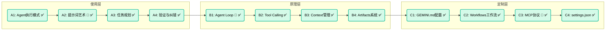

# 学习路径

```mermaid
graph LR
    classDef done fill:#d4fae8,stroke:#00b894,color:#000,stroke-width:2px
    classDef active fill:#74b9ff,stroke:#0984e3,color:#fff,stroke-width:2px
    classDef future fill:#dfe6e9,stroke:#b2bec3,color:#636e72
    classDef threshold fill:#ffeaa7,stroke:#fdcb6e,color:#000,stroke-width:2px

    subgraph Phase_A [使用层]
        A1(A1: Agent执行模式 ✅):::done
        A2(A2: 提示词艺术 🚧 ✅):::done
        A3(A3: 任务规划 ✅):::done
        A4(A4: 验证与纠错 ✅):::done
    end

    subgraph Phase_B [原理层]
        B1(B1: Agent Loop 🚧 ✅):::done
        B2(B2: Tool Calling ✅):::done
        B3(B3: Context管理 ✅):::done
        B4(B4: Artifacts系统 ✅):::done
    end

    subgraph Phase_C [定制层]
        C1(C1: GEMINI.md配置 ✅):::done
        C2(C2: Workflows工作流 ✅):::done
        C3(C3: MCP协议 🚧 ✅):::done
        C4(C4: settings.json ✅):::done
    end

    A1 --> A2 --> A3 --> A4
    A4 --> B1 --> B2 --> B3 --> B4
    B4 --> C1 --> C2 --> C3 --> C4
```

## 图例

- ✅ 已掌握
- 🚧 门槛概念
- 🔵 当前节点
