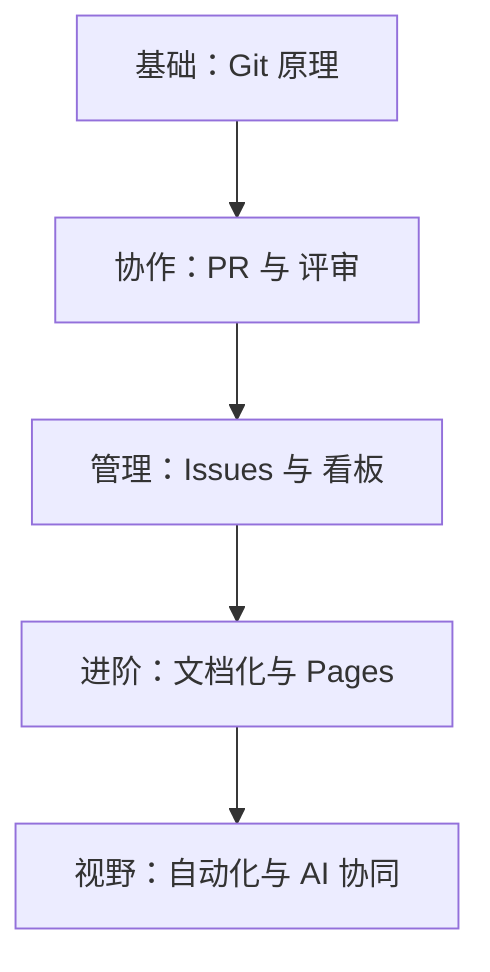

# GitHub for PM 全景导论：从“代码库”到“生产力中心”

> **版本**：2026.01-PM-Special
> **适用人群**：无代码基础的产品经理
> **核心目标**：构建与开发团队的深度信任，利用 GitHub 提升需求管理与文档协作效率。

---

## 1. 什么是 GitHub？（PM 的视角）

对于开发人员，GitHub 是**代码的保险箱**；但对于产品经理，GitHub 应该是你的**“工作坊窗口”**。

在 2026 年的今天，GitHub 已经不再仅仅是一个托管代码的地方。它是一个集成了 **AI 协作 (Copilot)**、**自动化流转 (Actions)** 和 **深度项目管理 (Projects)** 的完整生态。

**严谨定义**：GitHub 是基于 Git（版本控制工具）的云端协作平台。它允许团队在不干扰彼此的情况下，同时对同一份产品进行迭代，并保留完整的历史记录。

## 2. 为什么 PM 必须掌握 GitHub？

如果你仍然在用 Word 发送 PRD，或者在 IM 工具里追问“进度到哪了”，你正在产生巨大的**沟通熵**：

1.  **消除“信息不对称”**：在 GitHub 上，你可以直接看到代码的合并进度（PR），不再需要通过“问”来获取真实进度。
2.  **需求即代码**：将 Issue 与代码分支关联，让每一行代码改动都能追溯到最初的产品意图。
3.  **构建深度信任**：当你能看懂 Diff（代码差异）并能在 PR 下提出非技术性的业务建议时，开发团队会将你视为“懂行”的伙伴。
4.  **AI 赋能**：利用 GitHub Copilot 帮助你理解复杂的业务逻辑，或者自动生成结构化的 Issue 描述。

## 3. 核心概念速览

| 概念 | 类比 | 解释 |
| :--- | :--- | :--- |
| **Repository (仓库)** | 一个项目的总文件夹 | 包含代码、文档、配置的所有资产。 |
| **Commit (提交)** | 相机的“快照” | 记录一次改动及其原因（Commit Message）。 |
| **Branch (分支)** | 平行宇宙 | 让功能开发在独立空间进行，不影响线上稳定版。 |
| **Pull Request (PR)** | 合并申请书 | 开发请求将“野史”并入“正史”的过程，也是 PM 评审的场所。 |
| **Issue (议题)** | 任务卡片/缺陷单 | 记录一切待办事项，是需求管理的最小单元。 |
| **Actions (自动化)** | 自动流水线 | 比如：当 PM 标记 Issue 为“已通过”时，自动发送通知。 |

## 4. 知识地图 (Roadmap)

## 5. 常见误区与直觉陷阱

*   **误区 1：“我不写代码，就不需要用命令行”**
    *   *真相*：是的，你确实可以只用网页版。但理解命令行的逻辑（推、拉、暂存）会让你更清晰地理解开发在遭遇什么困难（如冲突）。
*   **误区 2：“GitHub Projects 只是简单的看板”**
    *   *真相*：与 Jira 相比，GitHub Projects 的优势在于**实时性**。代码一合并，任务自动变 Done，这种零成本的同步是其他工具无法比拟的。
*   **误区 3：“PR 评审是开发的事”**
    *   *真相*：PM 在 PR 中检查的是**业务逻辑实现**和**文案准确性**。

## 6. 学习路径预告

我们将按照以下四个阶段前进：
1.  **阶段 A (1.5h)**：攻克“分支与提交”，建立时间胶囊逻辑。
2.  **阶段 B (2.5h)**：掌握 PR 流程，学会如何在代码堆里“找茬”。
3.  **阶段 C (2.0h)**：配置你的 PM 工作台，让需求管理自动化。
4.  **阶段 D (1.5h)**：文档即代码，发布你的第一个在线产品文档。

---

## 🧐 思考题（读完后请回答）

1.  如果你发现线上的文案写错了，按照 GitHub 的逻辑，你觉得应该是直接在 `main` 分支改，还是开个新分支？为什么？
2.  在你的日常工作中，哪一类信息的流转最让你头疼？（比如：Bug 进度、需求变更通知、PRD 更新同步）。

---
**数据来源标注**：
- [GitHub Blog 2025/2026 AI Roadmap]
- [Department of Product: Git for PMs Guide]
- [Zenhub: State of Software Management 2025]