# 🎓 学习结业报告：GitHub for PM

**学员**：PM (产品经理)
**日期**：2026-01-10
**状态**：✅ 已完结 (掌握度 100%)

---

## 🗺️ 学习路径复盘

```mermaid
graph LR
    classDef done fill:#d4fae8,stroke:#00b894,color:#000,stroke-width:2px
    classDef threshold fill:#ffeaa7,stroke:#fdcb6e,color:#000,stroke-width:2px

    Step1("A1: 仓库与快照 ✅"):::done
    Step2("A2: 分支-平行宇宙 ✅"):::done
    Step3("B1: PR-对话的艺术 ✅"):::done
    Step4("B2: 冲突处理 🚧 ✅"):::threshold
    Step5("C1: Issues ✅"):::done
    Step6("C2: Projects ✅"):::done
    Step7("D1: Wiki与文档 🚧 ✅"):::threshold
    Step8("D2: README ✅"):::done

    Step1 --> Step2 --> Step3 --> Step4 --> Step5 --> Step6 --> Step7 --> Step8
```

| # | 节点 | 一句话总结 | 掌握日期 |
|---|------|-----------|---------|
| 1 | **A1. 仓库与快照** | Git 记录的是"修改后的世界长什么样"（Snapshot），而非"修改动作本身"。 | 2026-01-10 |
| 2 | **A2. 分支与平行宇宙** | 分支只是指向某个 Commit 的轻量级动态指针，创建分支极其廉价。 | 2026-01-10 |
| 3 | **B1. PR与评审** | PR 不是单纯的代码合并，而是关于代码的白盒审计会议。 | 2026-01-10 |
| 4 | **B2. 冲突处理** 🚧 | 冲突不是 Bug，是两个正确逻辑在时空中撞车，需要人来裁决。 | 2026-01-10 |
| 5 | **C1. Issues** | Issue 是 "Context 容器"，`Fixes #ID` 是自动化的咒语。 | 2026-01-10 |
| 6 | **C2. Project看板** | 从 "Human API" 升级为 "Traffic Control"，让代码驱动状态。 | 2026-01-10 |
| 7 | **D1. Wiki与文档** 🚧 | Docs as Code：对老板用 PPT 讲故事，对团队用 Markdown 讲逻辑。 | 2026-01-10 |
| 8 | **D2. README** | README 是项目的"接客之道"，Empty README = Dead Project。 | 2026-01-10 |

---

## 💎 核心洞察

*从你的回答中提炼的高价值思考：*

1. > **"快照思维"**：软件需要在时空中同时存在多个状态（线上的稳定版、开发中的测试版）。Git 把这个逻辑做到了极致。

2. > **"隔离价值"**：One Branch, One Feature。如果在一个分支里混做两件事，上线时就会被"捆绑销售"，导致风险耦合。

3. > **"白盒审计"**：Staging 只能验证现在的表现，PR 验证未来的健壮性。

4. > **"PR 不是静态文件，而是监控分支动态的窗口"**：GitHub 的 PR 页面是实时的，分支有新提交会立刻更新。

5. > **"角色转变"**：从 "Human API" (搬运状态) 升级为 "Traffic Control" (监控与规划)。State Automation 让代码驱动管理。

6. > **"反脆弱机制"**：信任 CI，不信任人。把命令写进自动化脚本，这是 **Executable Documentation (可执行文档)**。

---

## ⚠️ 踩过的坑汇总

### 类型A：概念误解

| 节点 | 误区 | 纠正 |
|-----|------|------|
| A1 | 以为 Git 像腾讯文档一样记录"谁在几点删了什么"（流水账） | Git 记录的是"修改后的世界长什么样"（Snapshot） |
| A2 | 认为分支是整个文件夹的物理拷贝（Copy & Paste） | 分支只是指向某个 Commit 的轻量级动态指针 |
| C1 | 以为 GitHub 全知全能，会自动把修好的代码和 Issue 对应起来 | 必须在 PR 里写明 `Fixes #42`，否则 Issue 依然 Open |
| C2 | 以为 Milestone 是总进度表 | Milestone 只能管一个仓库，Project 才能管整个产品线 |

### 类型B：工作流误判

| 节点 | 误区 | 纠正 |
|-----|------|------|
| B1 | 认为截图和录屏就能验收 | 过于信任黑盒表现（Staging），必须看 PR 内部逻辑 |
| B2 | 允许开发 "强推" 覆盖冲突代码 | 冲突是时空碰撞，必须"融合"（Merge），"覆盖"等于删除同事的工作成果，是重罪 |
| D1 | 强迫非技术干系人去 GitHub 看 Markdown 文档 | 文档分层：对上用 PPT，对内用 Markdown |
| D2 | 信任"人"会去维护文档 | 人一定会忘，唯一方法是写进 CI（Executable Documentation） |

---

## 💬 对话精华

*最精彩的类比与对话记录：*

### 1. 全景保险箱
> Repository 不仅仅装文件，还装历史。每次提交都是把当下的整个世界存进去。

### 2. 便利贴指针
> 分支就是贴在 Commit 上的便利贴，标记谁是当前最新的进度。移动分支（Reset）就是撕下便利贴贴到以前的 Commit 上。

### 3. 出版社审稿
> 作者不仅提交章节，还要写申请。编辑（PM）在旁边写批注，批准后才能印刷。

### 4. 自动驾驶
> 以前是手排挡（OmniFocus），不仅要看路还要换挡。现在是自动挡（GitHub Projects），手解放出来去摸方向盘（规划未来）。

### 5. Snapshot vs Stream
> Word/飞书是 **Snapshot**，发出来就死在那里了，容易过期。GitHub Docs 是 **Stream**，它随着代码分支的流动而实时变形。

---

## 🏆 实操验证高光

### 费曼全流程 (Capstone)
> **你的阐述**：
> "1. Issue定需求 → 2. Branch开发 → 3. Commit/PR → 4. Review循环 → 5. Merge上线 → 6. Docs沉淀 → 7. Close闭环"
>
> **评价**：完美的标准工作流。精准地将文档沉淀和 Issue 关闭均纳入了闭环。

### 实战找茬 (Simulation)
> **场景**：实习生提交了包含 `.docx` 附件且未关联 Issue 的 PR。
>
> **你的判决**：
> 1. **拒绝 Docx**：严厉指出 Word 格式低级，强制要求 Markdown 入库。
> 2. **拒绝无关联**：指出必须关联 Issue，否则无法触达 State Automation。
>
> **结论**：**Verified**. 已具备 Tech Lead 级别的代码审查意识。

---

## 📅 复习计划

| 节点 | 下次复习 | 间隔 |
|-----|---------|-----|
| A1. 仓库与快照 | 2026-01-11 | 1天 |
| A2. 分支与平行宇宙 | 2026-01-11 | 1天 |
| B1. PR与评审 | 2026-01-11 | 1天 |
| B2. 冲突处理 🚧 | 2026-01-11 | 1天 |
| C1. Issues | 2026-01-11 | 1天 |
| C2. Project看板 | 2026-01-11 | 1天 |
| D1. Wiki与文档 🚧 | 2026-01-11 | 1天 |
| D2. README | 2026-01-11 | 1天 |

> [!NOTE]
> 🚧 标记为**门槛节点**，复习时需重点关注。

---

## 📚 附录：掌握卡片索引

- [[WorkflowLearn/项目/GitHub_For_PM/掌握卡片/A1. 仓库与快照|A1. 仓库与快照]]
- [[WorkflowLearn/项目/GitHub_For_PM/掌握卡片/A2. 分支与平行宇宙|A2. 分支与平行宇宙]]
- [[WorkflowLearn/项目/GitHub_For_PM/掌握卡片/B1. PR与评审|B1. PR与评审]]
- [[WorkflowLearn/项目/GitHub_For_PM/掌握卡片/B2. 冲突处理|B2. 冲突处理]]
- [[WorkflowLearn/项目/GitHub_For_PM/掌握卡片/C1. Issues|C1. Issues]]
- [[WorkflowLearn/项目/GitHub_For_PM/掌握卡片/C2. Project看板|C2. Project看板]]
- [[WorkflowLearn/项目/GitHub_For_PM/掌握卡片/D1. Wiki与文档|D1. Wiki与文档]]
- [[WorkflowLearn/项目/GitHub_For_PM/掌握卡片/D2. README|D2. README]]
- [[WorkflowLearn/项目/GitHub_For_PM/掌握卡片/毕业总结|毕业总结]]

---

## 🚀 下一步建议

1. **实操**：去 GitHub 上开一个 Private Repo，把现有的 OmniPlan 任务试着搬一点上去。
2. **Review**：下次开发提代码时，不管多忙，点开 `Files Changed` 看一眼。
3. **README**：去看看公司现有项目的 README，试着按照 Quick Start 跑一下，如果报错，去提个 Issue。

---

*保持 **"Vibe Learning"**。*
