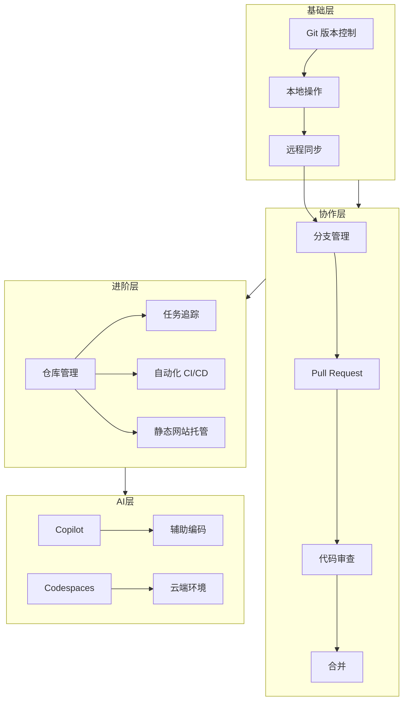

# 初始文档：GitHub 全景导论 (v1.0)

> [!NOTE]
> 这是一个基于 2025 年最新视角的 GitHub 全景概览。不仅关注传统的代码托管，更强调 AI 时代的协作与自动化。

## 1. 什么是 GitHub？

**严谨定义**：GitHub 是一个基于 **Git** 版本控制系统的云端开发平台，它为软件开发提供了**代码托管**、**协作开发**、**自动化流程 (CI/CD)** 以及 **AI 辅助编码** 的完整生态系统。

简单来说，如果 Git 是"时光机"（记录代码的历史版本），那么 GitHub 就是"平行宇宙交易所"（让不同的人在不同的平行时间线/分支上工作，最后完美合并）。

在 2025 年，GitHub 已经不仅仅是程序员的网盘，它是**全球最大的开源社区**，也是现代软件供应链的核心枢纽。

## 2. 为什么它对你（超级个体）至关重要？

1.  **职业简历**：你的 GitHub 贡献图（绿格子）是比简历更具说服力的技能证明。
2.  **团队协作标准**：全球 90% 以上的科技公司使用 Pull Request (PR) 工作流，掌握它是进入现代团队的门票。
3.  **自动化外包**：通过 GitHub Actions，你可以让机器人自动帮你跑测试、部署网站、甚至发推特。
4.  **AI 加持**：配合 GitHub Copilot 和 Codespaces，你可以随时随地用任何设备进行高效开发，无需配置本地环境。

## 3. 核心概念速览

| 概念 | 类比 | 核心作用 |
| :--- | :--- | :--- |
| **Repository (Repo)** | 项目文件夹 | 存放代码、文档、历史记录的地方。 |
| **Commit** | 游戏存档 | 一个时间点的快照，记录了"改了什么"和"谁改的"。 |
| **Branch** | 平行宇宙 | 让你在不影响主线（Main）的情况下尝试新功能。 |
| **Pull Request (PR)** | 提案/奏折 | "我改好了，请皇上过目并合并到主线"。协作的核心。 |
| **Issue** | 任务卡/工单 | 追踪 Bug、讨论新功能、记录想法的地方。 |
| **Actions** | 流水线机器人 | 监听事件（如 push），自动执行脚本（如测试、部署）。 |
| **Fork** | 影分身 | 复制别人的项目到你的名下，让你能自由修改而不影响原版。 |
| **Copilot** | AI 副驾驶 | 懂代码的 AI 助手，帮你写代码、写测试、解释代码。 |

## 4. 知识地图

## 5. 常见误区与直觉陷阱

-   **误区 1：Git == GitHub**
    -   *真相*：Git 是底层技术（像 MP3 格式），GitHub 是平台（像网易云音乐）。你可以在没有 GitHub 的情况下使用 Git。
-   **误区 2：Main 分支是用来直接写的**
    -   *真相*：在规范流程中，**Main 分支神圣不可侵犯**。永远不要直接在 Main 上 commit，永远只通过 PR 合并进来。
-   **误区 3：PR 只是为了合并代码**
    -   *真相*：PR 是**讨论和审查**的场所。代码质量的提升发生在 PR 的评论区，而不是代码写完的那一刻。
-   **误区 4：GitHub 只是存代码的**
    -   *真相*：GitHub 也是社交网络（Star/Follow）、项目管理工具（Projects/Issues）和个人品牌展示页（Profile README）。

## 6. 学习路径预告

我们将通过 `GitHub_Mastery` 项目，带你走过以下阶段：

1.  **独行侠阶段**：掌握 CLI/Desktop，流畅进行 add/commit/push，学会"后悔药"（回滚）。
2.  **团队协作者**：深入理解 Branch 和 PR，学会解决 Merge Conflict（合并冲突），习惯 Code Review。
3.  **自动化工匠**：编写第一个 GitHub Action，让重复劳动自动化。
4.  **开源探险家**：学会 Fork 开源项目，贡献代码，建立个人 Profile。

## 7. 延伸阅读

-   [Pro Git (官方权威指南)](https://git-scm.com/book/zh/v2)
-   [GitHub Skills (官方互动教程)](https://skills.github.com/)

---

### ❓ 思考问题

阅读完上述内容，请思考：

1.  如果你不小心把一个含有敏感密码的文件 commit 到了本地，还没 push，你觉得安全吗？如果 push 了呢？
2.  为什么说 "Pull Request" 这个名字有点反直觉？是谁 Pull 谁？
