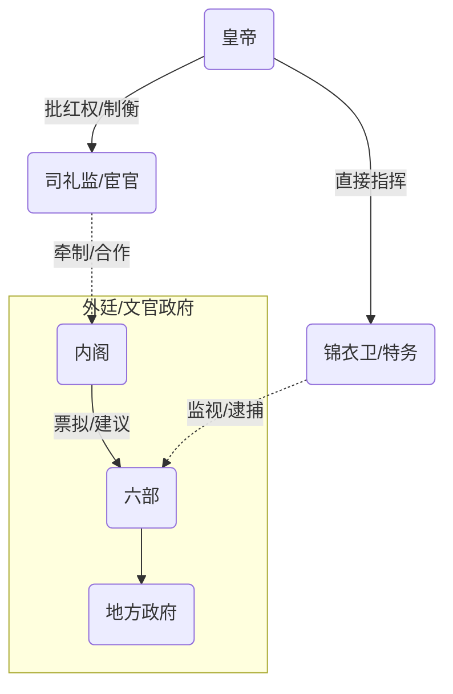

# 初始文档：明朝全景导论 (v1.0)

> [!NOTE]
> 明朝（1368-1644）是中国历史上最后一个由汉族建立的大一统王朝。它既有“天子守国门”的刚烈，也有“二十年不上朝”的荒诞。对于超级个体而言，明朝是研究**组织架构设计**、**权力制衡（权谋）**以及**系统性僵化**的最佳样本。

## 1. 为什么明朝值得深究？

1.  **权力的极致设计**：朱元璋废除了实行1600年的宰相制度，设计了一套看似完美的“皇帝独裁 + 秘书班子（内阁） + 监控探头（厂卫）”的三角模型。这是研究**集权管理**的顶级案例。
2.  **文官集团的巅峰**：明朝中后期，文官集团（如东林党）强大到足以与皇权抗衡。这是研究**科层制（Bureaucracy）**如何架空最高决策者的绝佳素材。
3.  **大航海时代的错过**：郑和下西洋比哥伦布早半个世纪，但明朝最终选择了海禁。这是研究**战略决策与路径依赖**的深刻教训。

## 2. 核心概念速览

| 概念 | 核心作用 | 现代类比 |
| :--- | :--- | :--- |
| **废相 (Abolition of Chancellor)** | 权力回收 | CEO 裁掉总经理，直接管理所有部门总监（六部）。 |
| **内阁 (Grand Secretariat)** | 秘书机构 | 董事会秘书处。只有建议权（票拟），没有决策权，但后期权重如宰相。 |
| **司礼监 (Directorate of Ceremonial)** | 皇权代行 | 皇帝的私人助理。拥有“批红”权（盖章），是皇帝用来制衡内阁的工具。 |
| **厂卫 (Chang-Wei Agencies)** | 特务统治 | 内部审计 + 纪委 + 克格勃。锦衣卫、东厂、西厂，绕过法律程序直接拿人。 |
| **朝贡体系 (Tribute System)** | 外交秩序 | 以“磕头换赏赐”建立的东亚国际贸易圈。 |
| **一条鞭法 (Single Whip Law)** | 税制改革 | 将各种苛捐杂税合并，统一用白银折算。是中国赋税货币化的里程碑。 |

## 3. 极简历史分期（三段论）

### 第一阶段：开创与立规（1368 - 1435）
*   **关键词**：猛人、集权、扩张
*   **洪武（朱元璋）**：开局一个碗，屠戮功臣，废除宰相，在此奠定基业。
*   **永乐（朱棣）**：靖难夺位，迁都北京，五征漠北，七下西洋，修大典。明朝版图与国威的巅峰。
*   **仁宣之治**：休养生息，类似“文景之治”。

### 第二阶段：守成与危机（1436 - 1572）
*   **关键词**：转折、内乱、中兴
*   **土木堡之变（1449）**：明英宗亲征被俘，精锐尽丧。明朝由攻转守的转折点。
*   **嘉靖（朱厚熜）**：沉迷修道但掌控力极强。发生了“大礼议”（皇统之争）和抗倭战争（戚继光）。
*   **隆庆开关**：有限度开放海禁，白银大量流入。

### 第三阶段：改革与崩塌（1573 - 1644）
*   **关键词**：党争、僵化、内忧外患
*   **万历（朱翊钧）**：前十年张居正改革（回光返照），后三十年怠政。
*   **天启（朱由校）**：木匠皇帝，魏忠贤专权，东林党争达到你死我活的地步。
*   **崇祯（朱由检）**：勤政的亡国之君。在李自成（内乱）和皇太极（外患）的夹击下，煤山自缢。

## 4. 权力结构图谱

明朝的政治本质是**皇帝利用“内廷”对抗“外廷”**。

## 5. 常见误区与直觉陷阱

-   **误区 1：明朝皇帝都是昏君/奇葩。**
    -   *真相*：明朝确实有个性极强的皇帝（豹房正德、修道嘉靖、木匠天启），但明朝制度的**容错率极高**。即便皇帝不上朝，国家机器依然能通过内阁和六部正常运转。
-   **误区 2：宦官都是坏人。**
    -   *真相*：在皇帝眼中，宦官是“家奴”，是唯一能信任并用来对抗庞大文官集团（士大夫）的工具。没有宦官，皇帝可能会被文官彻底架空。
-   **误区 3：明朝是因为穷死的。**
    -   *真相*：明朝后期白银流入巨大，民间富庶（江南资本主义萌芽）。死因是**财政汲取能力失效**——收不上税，钱都在权贵手里，国库空虚导致发不出军饷。

## 6. 学习路径预告

我们将按照以下顺序深入：
1.  **制度设计篇**：朱元璋如何废相？这套系统有什么先天Bug？
2.  **关键转折篇**：土木堡之变——大明战神是如何把家底败光的？
3.  **改革与权谋篇**：张居正改革——帝国最后的救命稻草与人亡政息。
4.  **亡国复盘篇**：崇祯是不是背锅侠？明朝到底亡于流贼还是满清？

---

### ❓ 思考问题

阅读完上述内容，请思考：

1.  如果你是朱元璋，为了防止子孙被权臣篡位（像曹操、司马懿那样），除了废除宰相，你还有什么别的办法吗？废相真的解决问题了吗？
2.  为什么明朝的皇帝特别喜欢用太监？难道他们不知道太监名声不好吗？
