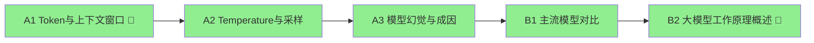

# 学习报告：大模型基础认知

> **项目状态**：✅ 已完成
> **学习周期**：2026-01-22（单日完成）
> **节点数量**：5 个（含 2 个门槛概念）

---

## 一、学习路径复盘

| 节点 | 一句话总结 | 掌握日期 |
|------|-----------|---------|
| **A1** | Token 估算（1:0.7-0.8）+ 注意力稀释是关键认知 | 2026-01-22 |
| **A2** | Temperature 控制「稳定性」而非「力度」，Prompt 和参数是两种不同的调节手段 | 2026-01-22 |
| **A3** | 「限定数据范围」≠ 杜绝幻觉，因为模型没有「只看文档」的硬开关 | 2026-01-22 |
| **B1** | 选型三维度：能力×约束×性价比；ToG 项目合规优先 | 2026-01-22 |
| **B2** | 大模型是「编」不是「查」，用词语接龙比喻最到位 | 2026-01-22 |

---

## 二、核心洞察（用户原话）

### 洞察 1：Temperature 的正确类比

> 「Temperature 给我的理解是『我用力踩下去（temperature 提高），油量的输出会更随机，导致我的速度忽快忽慢』」

**价值**：纠正了「油门灵敏度」的错误类比，Temperature 是稳定性参数，不是力度参数。

### 洞察 2：Prompt 控制 vs 参数控制

> 「这里『换不同的表达方式』是不是可以认为是临时调高 temperature？」

**价值**：主动追问两种手段的区别，得出结论：Prompt 是方向盘，Temperature 是油门稳定性。

### 洞察 3：NotebookLM 的「硬开关」本质

> 「我代入了自己之前使用 notebooklm 的经验，它的一个巨大的卖点就是，严格遵循已上传的文档或者内容来作答」

**价值**：用实际产品体验印证理论，理解了「硬开关」是产品层约束而非模型能力。

### 洞察 4：ToG 项目沟通话术

> 「领导，首先我想说 ChatGPT 是美国的产品，我们如果使用它，会面临合规问题，很有可能上级在审批的时候会因为这个问题驳回我们的方案」

**价值**：把技术选型转化为领导能听懂的风险语言，先打合规牌再讲技术。

### 洞察 5：给外行讲大模型的关键修正

> 「就好像词语接龙一样，我说了上句，他根据他的知识来揣测和拼接，得到下句」

**价值**：从「检索」修正为「联想/接龙」，避免让外行误以为大模型是搜索引擎。

---

## 三、踩过的坑

### 认知偏差类

| 错误 | 纠正 |
|------|------|
| 用「检索」描述大模型工作方式 | 应为「联想/预测」，大模型是「编」不是「查」|
| 认为「限定数据范围」能杜绝事实错误 | 模型没有「只看文档」的硬开关，仍可能混淆 |

### 场景分析类

| 错误 | 纠正 |
|------|------|
| 政策问答场景「最可能」只选一种幻觉类型 | 事实错误和逻辑矛盾都会出现，需分别防护 |

---

## 四、对话精华

### 精华 1：搜索引擎 vs 大模型

> **AI**：「搜索引擎是去数据库里**找**现成答案，大模型是根据学过的规律**生成**新内容。结果是检索出来的 vs 结果是编出来的。」

### 精华 2：硬开关 vs 软约束

> **AI**：「硬开关 = 物理断电，设备不可能工作；Prompt 限制 = 贴个『请勿触摸』的标签，大多数人遵守，但不是绝对。」

### 精华 3：三句话给领导讲大模型

> 「大模型就像一个读过全网内容的人在玩词语接龙。您说上半句，它根据以前看过的规律，猜下半句最可能是什么，一个字一个字往外蹦。所以它很聪明，但也可能猜错——它是在『编』，不是在『查』。」

---

## 五、复习计划（艾宾浩斯曲线）

| 复习轮次 | 日期 | 状态 |
|---------|------|------|
| 第 1 轮 | 2026-01-25 | ⏳ 待复习 |
| 第 2 轮 | 2026-01-29 | ⏳ |
| 第 3 轮 | 2026-02-05 | ⏳ |
| 第 4 轮 | 2026-02-20 | ⏳ |

---

## 六、掌握卡片索引

| 卡片 | 核心内容 |
|------|---------|
| [A1. Token与上下文窗口](掌握卡片/A1.%20Token与上下文窗口.md) | Token 估算、注意力稀释 |
| [A2. Temperature与采样](掌握卡片/A2.%20Temperature与采样.md) | 参数配置、Prompt vs 参数 |
| [A3. 模型幻觉与成因](掌握卡片/A3.%20模型幻觉与成因.md) | 三种幻觉、硬开关 vs 软约束 |
| [B1. 主流模型对比](掌握卡片/B1.%20主流模型对比.md) | 选型决策树、ToG 话术 |
| [B2. 大模型工作原理概述](掌握卡片/B2.%20大模型工作原理概述.md) | 词语接龙比喻、编 vs 查 |

---

> **报告生成时间**：2026-01-22
