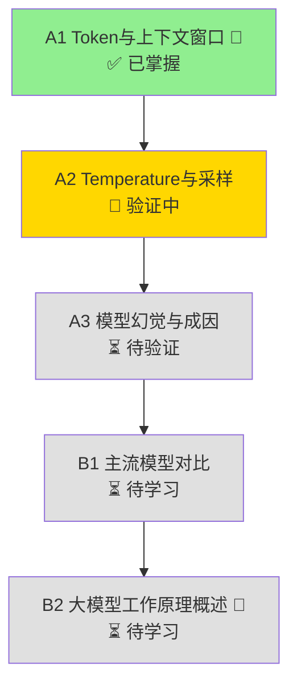

# 学习路径

## 路径图

## 节点详情

### A 层：基础概念

| 节点 | 核心内容 | 验证输出 | 门槛 |
|------|---------|---------|------|
| **A1** | Token 估算、Context Window 限制、注意力稀释 | 场景分析：估算 Token + Context 决策 | 🚧 |
| **A2** | Temperature 机制、采样参数、场景配置 | 为 3 个业务场景设计 Temperature 配置 | |
| **A3** | 幻觉类型、成因、缓解方法 | 案例归因 + ToG 项目幻觉场景分析 | |

### B 层：综合理解

| 节点 | 核心内容 | 验证输出 | 门槛 |
|------|---------|---------|------|
| **B1** | 主流模型特点、价格、选型逻辑 | 为「城市大脑」类项目选型并论述 | |
| **B2** | 预测下一个词、训练流程、产品含义 | 5 分钟讲解脚本（含甲方汇报版本） | 🚧 |

## 图例

- 🚧 门槛概念：错误阈值 >4 次才回退
- ✅ 已掌握
- 🔄 进行中
- ⏳ 待解锁
