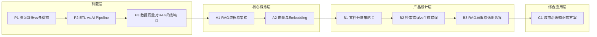

# 学习路径

---

## 节点详情

| 节点 | 核心内容 | 验证输出 | 门槛 | 易混淆警告 |
|------|---------|---------|------|------------|
| **P1** | 多源数据 vs 多模态：术语映射 | 用 AI 语言重述城市大脑数据融合经验 | | |
| **P2** | ETL vs AI Pipeline：理解标注、向量化 | 流程对比图 | | |
| **P3** | 数据质量对 RAG 的影响 | 质量维度清单 + 城市数据导致 RAG 失效案例 | 🚧 | |
| **A1** | RAG 流程与架构 | 手绘流程图 + 与城市数据管道对比 | | |
| **A2** | 向量与 Embedding、相似度计算 | 类比解释（GPS 坐标/方向指向）| | ⚠️ Embedding模型 vs 大模型，向量 vs Embedding |
| **B1** | 文档分块策略 | 为城市政策法规设计分块方案 | 🚧 | |
| **B2** | 检索错误 vs 生成错误 | 错误诊断案例分析 | | ⚠️ 检索错误 vs 生成错误 |
| **B3** | RAG 局限与适用边界 | 城市治理场景 RAG 适用性判断清单 | | |
| **C1** | 综合：城市治理知识库方案 | 完整设计文档 | | |
