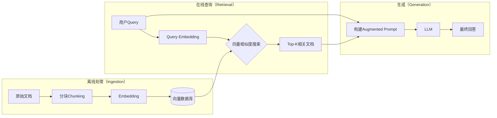
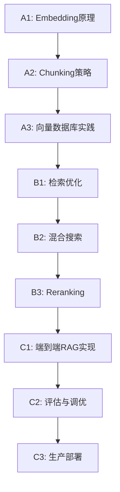

# RAG与向量数据库实战：全景导论

> **源真理版本**：v1.0 (AI生成，基于2024年最新调研)  
> **信息来源**：IBM、OpenAI、Databricks、Milvus、Pinecone官方文档及Stack Overflow、DataCamp等权威技术平台

---

## 一、什么是RAG？

### 严谨定义

**RAG (Retrieval-Augmented Generation)** 是一种将**信息检索**与**大语言模型生成**结合的架构模式。

> RAG的核心思想：不要让LLM凭空编造，而是先从外部知识库中找到相关信息，再让LLM基于这些信息生成回答。

### 为什么需要RAG？

LLM有三个致命缺陷：

1. **知识截止**：训练数据有时效性，无法获取最新信息
2. **幻觉问题**：会「一本正经地胡说八道」
3. **缺乏私有知识**：无法访问企业内部文档、个人笔记等

RAG通过「检索→增强→生成」的流程，让LLM的回答**有据可依**。

---

## 二、RAG架构剖析

### 核心流程

```
用户查询 → [Embedding] → 向量检索 → 相关文档 → [Augmented Prompt] → LLM生成 → 最终回答
```

### 两大核心组件

| 组件 | 职责 | 关键技术 |
|------|------|----------|
| **Retriever（检索器）** | 从知识库中找到最相关的文档片段 | 向量数据库、Embedding模型、混合搜索 |
| **Generator（生成器）** | 基于检索到的上下文生成回答 | LLM、Prompt Engineering |

### 架构图



---

## 三、核心概念速览

### 🔹 1. Embedding（嵌入）

将文本转换为高维向量（通常768-3072维），使得语义相似的文本在向量空间中距离相近。

**主流Embedding模型（2024）**：
- `text-embedding-3-small`：OpenAI性价比之选，成本降低5倍
- `text-embedding-3-large`：OpenAI最强模型，3072维
- `bge-large-zh`：中文场景优秀的开源模型
- `e5-mistral-7b-instruct`：指令式Embedding，适合复杂查询

### 🔹 2. Chunking（分块策略）

将长文档切分为LLM上下文窗口能容纳的小块。

| 策略 | 描述 | 适用场景 |
|------|------|----------|
| **Fixed-Length** | 固定字符/Token数切分 | 简单场景、结构化文档 |
| **Sentence-Based** | 按句子边界切分 | 需要完整语义的场景 |
| **Recursive** | 先尝试大分隔符（段落），不行再用小的（句子） | 通用场景，推荐 |
| **Semantic** | 基于语义相似度切分 | 复杂文档，内容跳跃大 |
| **Parent-Child** | 小块用于检索，返回大块给LLM | 需要上下文完整性 |

**最佳实践**：Chunk大小通常256-512 tokens，Overlap 50-100 tokens。

### 🔹 3. 向量数据库

专门存储和检索向量的数据库。核心能力：**ANN（近似最近邻搜索）**。

**四大主流向量数据库对比**：

| 数据库 | 类型 | 最大优势 | 适用场景 |
|--------|------|----------|----------|
| **Pinecone** | 全托管（闭源） | 零运维，开箱即用 | 快速上线、不想管基础设施 |
| **Weaviate** | 开源/托管 | 混合搜索（向量+关键词+元数据） | RAG复杂查询、需要灵活过滤 |
| **Milvus** | 开源（Zilliz托管） | 超大规模（数十亿向量） | 企业级、自托管、极端规模 |
| **Chroma** | 开源（轻量） | 简单API，嵌入式 | 原型开发、本地调试、学习 |

### 🔹 4. 混合搜索（Hybrid Search）

结合**向量搜索**（语义匹配）和**关键词搜索**（BM25精确匹配）的优势。

> 用户搜"Python报错TypeError"：
> - 向量搜索：找到语义相近的「类型错误处理」文档
> - 关键词搜索：精确匹配包含"TypeError"的文档
> - 混合搜索：两者结合，召回率+准确率双提升

### 🔹 5. Reranking（重排序）

检索后对结果进行二次排序，让最相关的排前面。

**常用Reranker**：
- Cohere Rerank
- cross-encoder模型
- LLM-as-Reranker

### 🔹 6. Query Transformation（查询改写）

用户的原始查询往往「词不达意」，通过改写提升检索效果。

| 技术 | 描述 |
|------|------|
| **Query Expansion** | 扩展同义词、相关概念 |
| **HyDE** | 让LLM先生成假设性答案，用答案去检索 |
| **Multi-Query** | 生成多个变体查询，合并检索结果 |

### 🔹 7. Context Window（上下文窗口）

LLM单次能处理的最大Token数。影响能塞多少检索结果给LLM。

- GPT-4o：128K tokens
- Claude 3.5：200K tokens
- Gemini 2.0：2M tokens

### 🔹 8. Prompt Engineering for RAG

如何将检索到的文档优雅地融入Prompt中。

```
你是一个知识助手。根据以下参考资料回答用户问题。
如果资料中没有相关信息，请明确说明"资料中未找到相关信息"。

【参考资料】
{retrieved_context}

【用户问题】
{user_query}
```

---

## 四、RAG进阶架构（2024趋势）

### Agentic RAG

RAG + Agent：检索不再是一次性的，而是Agent根据用户问题动态决定：
- 需不需要检索？
- 检索哪个知识库？
- 检索结果不够怎么办？

### Fusion RAG

结合多种检索方法（向量、关键词、知识图谱），取长补短。

### Speculative RAG

小模型快速生成草稿，大模型验证和完善，提升效率。

### Multimodal RAG

不仅检索文本，还能检索图片、表格、视频等多模态内容。

---

## 五、常见误区与直觉陷阱

### ❌ 误区1：「Chunk越小越好」

**真相**：太小会丢失上下文。一个句子「它」指代什么？只有放在段落中才能理解。

### ❌ 误区2：「向量搜索能替代关键词搜索」

**真相**：向量搜索擅长语义相似，但对精确术语（如错误码、产品型号）可能不如关键词。

### ❌ 误区3：「召回Top-1就够了」

**真相**：单一文档可能只包含部分答案，需要综合多个来源。通常Top-5到Top-10。

### ❌ 误区4：「Embedding模型不需要调优」

**真相**：通用Embedding在特定领域（如法律、医学）可能效果不佳，Fine-tune能大幅提升。

### ❌ 误区5：「RAG解决了幻觉问题」

**真相**：RAG降低了幻觉，但LLM仍可能曲解或无视检索到的内容。需要严格的Prompt约束。

---

## 六、学习路径预告

你将学习的核心节点：



---

## 七、延伸阅读

### 官方文档
- [OpenAI Embedding Guide](https://platform.openai.com/docs/guides/embeddings)
- [LangChain RAG Tutorial](https://python.langchain.com/docs/tutorials/rag/)
- [Milvus Documentation](https://milvus.io/docs)

### 经典论文
- Lewis et al. (2020) — 《Retrieval-Augmented Generation for Knowledge-Intensive NLP Tasks》原始RAG论文

### 推荐书籍
- 《Building LLM Apps》(O'Reilly)
- 《Designing Large Language Model Applications》

---

## 八、思考问题

读完这篇导论，尝试不看上文回答：

1. **RAG解决了LLM的哪三个核心问题？这三个问题之间有没有关联？**

2. **为什么需要Chunking？如果直接把整篇文档扔给Embedding会怎样？**

3. **向量搜索和关键词搜索各自的优劣是什么？什么场景下需要混合搜索？**

---

> **下一步**：读完后告诉我你的第一个困惑，或补充你自己的学习材料。
