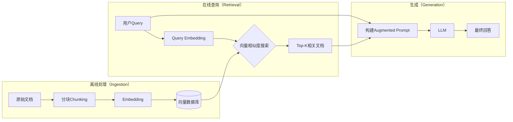
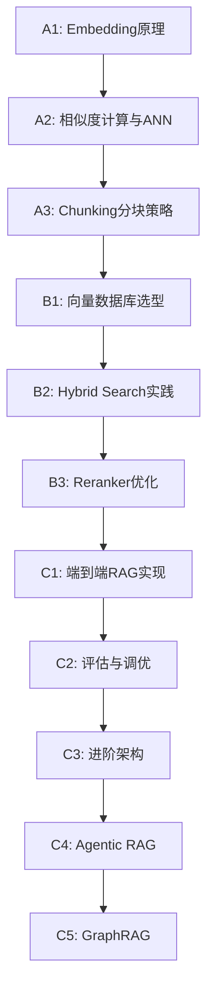

# RAG与向量数据库实战：全景导论

> **源真理版本**：v1.1 (AI生成，基于2026年1月最新调研)
> **更新内容**：Agentic RAG、GraphRAG、Hybrid Search 深化、Reranker 实践
> **信息来源**：IBM、OpenAI、Anthropic、Databricks、Milvus、Pinecone官方文档及Stack Overflow、DataCamp等权威技术平台

---

## 一、什么是RAG？

### 严谨定义

**RAG (Retrieval-Augmented Generation)** 是一种将**信息检索**与**大语言模型生成**结合的架构模式。

> RAG的核心思想：不要让LLM凭空编造，而是先从外部知识库中找到相关信息，再让LLM基于这些信息生成回答。

### 为什么需要RAG？

LLM有三个致命缺陷：

1. **知识截止**：训练数据有时效性，无法获取最新信息
2. **幻觉问题**：会「一本正经地胡说八道」
3. **缺乏私有知识**：无法访问企业内部文档、个人笔记等

RAG通过「检索→增强→生成」的流程，让LLM的回答**有据可依**。

---

## 二、RAG架构剖析

### 核心流程

```
用户查询 → [Embedding] → 向量检索 → 相关文档 → [Augmented Prompt] → LLM生成 → 最终回答
```

### 两大核心组件

| 组件 | 职责 | 关键技术 |
|------|------|----------|
| **Retriever（检索器）** | 从知识库中找到最相关的文档片段 | 向量数据库、Embedding模型、混合搜索 |
| **Generator（生成器）** | 基于检索到的上下文生成回答 | LLM、Prompt Engineering |

### 架构图



---

## 三、核心概念速览

### 🔹 1. Embedding（嵌入）

将文本转换为高维向量（通常768-3072维），使得语义相似的文本在向量空间中距离相近。

**主流Embedding模型（2026）**：
- `text-embedding-3-large`：OpenAI 旗舰，3072维，多语言优秀
- `text-embedding-3-small`：OpenAI 性价比之选，1536维
- `voyage-3`：Anthropic 投资的 Voyage AI，检索任务 SOTA
- `bge-m3`：BAAI 开源，支持中英日韩多语言，支持稀疏+稠密混合
- `jina-embeddings-v3`：1B 参数，8K 上下文，支持 Matryoshka 可变维度

### 🔹 2. Chunking（分块策略）

将长文档切分为LLM上下文窗口能容纳的小块。

| 策略 | 描述 | 适用场景 |
|------|------|----------|
| **Fixed-Length** | 固定字符/Token数切分 | 简单场景、结构化文档 |
| **Sentence-Based** | 按句子边界切分 | 需要完整语义的场景 |
| **Recursive** | 先尝试大分隔符（段落），不行再用小的（句子） | 通用场景，推荐 |
| **Semantic** | 基于语义相似度切分 | 复杂文档，内容跳跃大 |
| **Parent-Child** | 小块用于检索，返回大块给LLM | 需要上下文完整性 |

**最佳实践**：Chunk大小通常256-512 tokens，Overlap 50-100 tokens。

### 🔹 3. 向量数据库

专门存储和检索向量的数据库。核心能力：**ANN（近似最近邻搜索）**。

**四大主流向量数据库对比**：

| 数据库 | 类型 | 最大优势 | 适用场景 |
|--------|------|----------|----------|
| **Pinecone** | 全托管（闭源） | 零运维，开箱即用 | 快速上线、不想管基础设施 |
| **Weaviate** | 开源/托管 | 混合搜索（向量+关键词+元数据） | RAG复杂查询、需要灵活过滤 |
| **Milvus** | 开源（Zilliz托管） | 超大规模（数十亿向量） | 企业级、自托管、极端规模 |
| **Chroma** | 开源（轻量） | 简单API，嵌入式 | 原型开发、本地调试、学习 |

### 🔹 4. 混合搜索（Hybrid Search）

结合**向量搜索**（语义匹配）和**关键词搜索**（BM25精确匹配）的优势。

> 用户搜"Python报错TypeError"：
> - 向量搜索：找到语义相近的「类型错误处理」文档
> - 关键词搜索：精确匹配包含"TypeError"的文档
> - 混合搜索：两者结合，召回率+准确率双提升

**Hybrid Search 实现方式**：

| 方式 | 描述 | 示例 |
|------|------|------|
| **RRF (Reciprocal Rank Fusion)** | 基于排名的融合，无需调参 | 默认推荐，Weaviate/Elasticsearch 原生支持 |
| **加权线性组合** | `α × 向量分数 + (1-α) × BM25分数` | 需要调优 α 参数 |
| **Late Interaction** | 先各自检索，再用 Reranker 融合排序 | ColBERT 等模型 |

**ToG 场景**：政策法规搜索时，用户可能搜「外来人口落户条件」（语义）或搜「沪府规〔2024〕3号」（精确）。混合搜索能同时覆盖两种查询模式

### 🔹 5. Reranking（重排序）

检索后对结果进行二次排序，让最相关的排前面。

**为什么需要 Reranker？**
- Embedding 是「双塔模型」：Query 和 Document 分别编码后计算相似度，速度快但精度有限
- Reranker 是「交叉编码器」：Query 和 Document 一起输入模型，能捕捉更细粒度的相关性

**2026 主流 Reranker**：

| Reranker | 特点 | 适用场景 |
|----------|------|----------|
| **Cohere Rerank 3.5** | API 调用，多语言，效果好 | 生产环境首选 |
| **Voyage Reranker** | Anthropic 生态，与 Claude 配合好 | Claude 用户 |
| **bge-reranker-v2-m3** | 开源，支持中英，可本地部署 | 成本敏感/数据敏感 |
| **LLM-as-Reranker** | 用 GPT-4o 等大模型做 Rerank | 复杂场景，成本高 |

**Reranker Pipeline 示例**：
```
用户 Query → 向量检索 Top-50 → Reranker 重排 → 返回 Top-5 → LLM 生成
```

**核心权衡**：Reranker 提升精度但增加延迟和成本。建议：先 Top-50 粗筛，再 Rerank 到 Top-5

### 🔹 6. Query Transformation（查询改写）

用户的原始查询往往「词不达意」，通过改写提升检索效果。

| 技术 | 描述 |
|------|------|
| **Query Expansion** | 扩展同义词、相关概念 |
| **HyDE** | 让LLM先生成假设性答案，用答案去检索 |
| **Multi-Query** | 生成多个变体查询，合并检索结果 |

### 🔹 7. Context Window（上下文窗口）

LLM单次能处理的最大Token数。影响能塞多少检索结果给LLM。

| 模型 | 上下文窗口 | 备注 |
|------|-----------|------|
| GPT-4o | 128K tokens | 约 300 页文本 |
| Claude Opus 4.5 | 200K tokens | 约 500 页文本 |
| Gemini 3 Pro | 1M tokens | 约 1500 页文本 |

**长上下文 vs RAG**：上下文窗口越大，是不是就不需要 RAG 了？

| 方案 | 优势 | 劣势 |
|------|------|------|
| **纯长上下文** | 简单，不丢信息 | 成本高（按 Token 计费），「大海捞针」效果下降 |
| **RAG** | 成本低，可更新知识 | 检索可能漏掉关键信息 |
| **RAG + 长上下文** | 检索精准 + 上下文丰富 | 推荐的平衡方案 |

### 🔹 8. Prompt Engineering for RAG

如何将检索到的文档优雅地融入Prompt中。

```
你是一个知识助手。根据以下参考资料回答用户问题。
如果资料中没有相关信息，请明确说明"资料中未找到相关信息"。

【参考资料】
{retrieved_context}

【用户问题】
{user_query}
```

---

## 四、RAG进阶架构（2026趋势）

### 4.1 Agentic RAG（Agent 驱动的 RAG）

**核心思想**：RAG 不再是「一次检索」，而是 Agent 根据问题**动态规划**检索策略。

**传统 RAG vs Agentic RAG**：

| 维度 | 传统 RAG | Agentic RAG |
|------|---------|-------------|
| 检索次数 | 固定一次 | 动态多次，直到信息充足 |
| 知识源选择 | 固定一个库 | 根据问题选择合适的库 |
| 检索策略 | 向量相似度 | 可切换向量/关键词/SQL/API |
| 错误处理 | 检索失败就放弃 | 自动调整策略重试 |

**Agentic RAG 流程示例**：
```
用户问：「2024年上海市新增落户政策中，对应届毕业生有什么优惠？」

Agent 思考：
1. 需要检索「落户政策」知识库 ✅
2. 时间限定「2024年」，需要精确匹配
3. 群体限定「应届毕业生」

Agent 行动：
Step 1: 向量检索「上海落户政策 应届毕业生」→ 得到 5 篇文档
Step 2: 检查时效性 → 发现 3 篇是 2023 年的
Step 3: 追加关键词检索「2024年 沪府规」→ 得到 2 篇新文档
Step 4: 综合 4 篇 2024 年相关文档，生成回答
```

**ToG 场景价值**：
- 政策库涉及多部门、多年份，Agent 能自动判断该查哪个库
- 遇到「最新政策」类问题，能自动过滤旧版本

### 4.2 GraphRAG（图谱增强 RAG）

**核心思想**：不只存储文档片段，还存储**实体关系图谱**，支持多跳推理。

**传统 RAG 的局限**：
```
问：「张三的领导是谁？张三的领导管理哪些部门？」

传统 RAG：
- 检索到「张三，隶属于 XX 科室」
- 检索到「李四是 XX 科室的科长」
- ❌ 无法自动关联两条信息做多跳推理
```

**GraphRAG 的解决方案**：
```
知识图谱：
张三 --[隶属于]--> XX科室
李四 --[领导]--> XX科室
李四 --[管理]--> [XX科室, YY科室, ZZ科室]

GraphRAG：
- 根据 Query 定位起点实体「张三」
- 沿关系边遍历：张三 → XX科室 → 李四 → [管理的部门]
- ✅ 自动完成多跳推理
```

**GraphRAG 架构**：
```
原始文档 → 实体抽取(NER) → 关系抽取 → 知识图谱
                                           ↓
用户 Query → 实体识别 → 图谱遍历 → 子图检索 → LLM 生成
```

**适用场景**：
- 组织架构查询（谁管谁，谁负责什么）
- 政策引用链（A 政策依据 B 条例，B 依据 C 法规）
- 事件因果链（A 事件导致 B，B 引发 C）

**实现工具**：
- **Microsoft GraphRAG**：开源，基于 LLM 自动构建图谱
- **Neo4j + LangChain**：成熟的图数据库 + RAG 框架组合
- **LlamaIndex Knowledge Graph**：支持自动实体/关系抽取

### 4.3 Self-RAG（自我反思 RAG）

**核心思想**：LLM 不仅生成回答，还**自我评估**检索结果和生成质量。

**Self-RAG 流程**：
```
Step 1: 判断是否需要检索 [Retrieve: Yes/No]
Step 2: 检索后评估相关性 [IsRel: Relevant/Irrelevant]
Step 3: 生成回答
Step 4: 评估是否有幻觉 [IsSup: Fully/Partially/No Support]
Step 5: 评估回答有用性 [IsUse: 5/4/3/2/1]
```

**价值**：减少「检索了但没用上」的浪费，避免「检索到错误信息」的误导。

### 4.4 Corrective RAG（纠错 RAG）

**核心思想**：检索结果不理想时，**自动纠错**而非直接放弃。

**CRAG 流程**：
```
检索结果 → 置信度评估
    ├─ 高置信度 → 直接使用
    ├─ 中置信度 → 知识精炼（过滤噪音、抽取关键句）
    └─ 低置信度 → 触发 Web 搜索补充
```

**ToG 场景**：内部知识库查不到时，自动搜索政府官网公开信息补充。

### 4.5 Multimodal RAG（多模态 RAG）

**核心思想**：不仅检索文本，还能检索**图片、表格、PDF 中的图表**。

**实现路径**：

| 方案 | 描述 | 适用场景 |
|------|------|----------|
| **图片描述 + 文本检索** | 用多模态模型生成图片描述，存为文本 | 简单图片，如照片 |
| **多模态 Embedding** | 用 CLIP 等模型直接编码图片为向量 | 图片相似性搜索 |
| **结构化抽取** | 从表格/图表中抽取结构化数据 | 报表类文档 |

**ToG 场景**：城市事件上报时，用户上传的现场照片也能参与检索，找到「类似场景的处置案例」。

### 4.6 进阶架构选型指南

| 场景 | 推荐架构 | 理由 |
|------|---------|------|
| 多知识库、复杂查询 | Agentic RAG | 动态选择检索策略 |
| 多跳推理、关系查询 | GraphRAG | 图谱支持实体关联 |
| 高准确率要求 | Self-RAG / CRAG | 自我评估 + 纠错 |
| 图文混合文档 | Multimodal RAG | 多模态检索 |
| 通用知识问答 | 传统 RAG + Reranker | 够用且稳定 |

---

## 五、常见误区与直觉陷阱

### ❌ 误区1：「Chunk越小越好」

**真相**：太小会丢失上下文。一个句子「它」指代什么？只有放在段落中才能理解。

### ❌ 误区2：「向量搜索能替代关键词搜索」

**真相**：向量搜索擅长语义相似，但对精确术语（如错误码、产品型号）可能不如关键词。

### ❌ 误区3：「召回Top-1就够了」

**真相**：单一文档可能只包含部分答案，需要综合多个来源。通常Top-5到Top-10。

### ❌ 误区4：「Embedding模型不需要调优」

**真相**：通用Embedding在特定领域（如法律、医学）可能效果不佳，Fine-tune能大幅提升。

### ❌ 误区5：「RAG解决了幻觉问题」

**真相**：RAG降低了幻觉，但LLM仍可能曲解或无视检索到的内容。需要严格的Prompt约束。

---

## 六、学习路径预告

你将学习的核心节点：



### 学习节点说明

| 层级 | 节点 | 核心内容 | 验证输出 |
|------|------|---------|----------|
| **A层：基础** | A1 | Embedding 原理与模型选型 | 对比 3 种 Embedding 模型的适用场景 |
| | A2 | 相似度计算（余弦/欧氏/点积）与 ANN | 解释 HNSW 索引原理 |
| | A3 | Chunking 分块策略 | 为政策法规文档设计分块方案 |
| **B层：实践** | B1 | 向量数据库选型与部署 | 对比 Pinecone/Weaviate/Milvus 的适用场景 |
| | B2 | Hybrid Search（向量+BM25）| 实现一个 Hybrid Search 示例 |
| | B3 | Reranker 优化 | 为政务问答加入 Reranker 并对比效果 |
| **C层：进阶** | C1 | 端到端 RAG Pipeline | 构建完整的政策问答系统 |
| | C2 | RAG 评估指标与调优 | 使用 Ragas 评估 RAG 效果 |
| | C3 | 进阶架构概览 | 分析 5 种进阶架构的适用场景 |
| | C4 | Agentic RAG 🚧 | 设计多知识库动态检索的 Agent |
| | C5 | GraphRAG 🚧 | 为组织架构/政策引用链构建知识图谱 |

---

## 七、延伸阅读

### 官方文档
- [OpenAI Embedding Guide](https://platform.openai.com/docs/guides/embeddings)
- [LangChain RAG Tutorial](https://python.langchain.com/docs/tutorials/rag/)
- [Milvus Documentation](https://milvus.io/docs)

### 经典论文
- Lewis et al. (2020) — 《Retrieval-Augmented Generation for Knowledge-Intensive NLP Tasks》原始RAG论文

### 推荐书籍
- 《Building LLM Apps》(O'Reilly)
- 《Designing Large Language Model Applications》

---

## 八、思考问题

读完这篇导论，尝试不看上文回答：

1. **RAG解决了LLM的哪三个核心问题？这三个问题之间有没有关联？**

2. **为什么需要Chunking？如果直接把整篇文档扔给Embedding会怎样？**

3. **向量搜索和关键词搜索各自的优劣是什么？什么场景下需要混合搜索？**

4. **Reranker 为什么能提升检索精度？为什么不直接用 Reranker 做第一轮检索？**

5. **Agentic RAG 和传统 RAG 的核心区别是什么？什么场景下值得用 Agentic RAG？**

6. **GraphRAG 解决了什么传统 RAG 解决不了的问题？举一个 ToG 场景的例子。**

7. **上下文窗口越来越大（Gemini 已经 1M），RAG 还有存在的必要吗？**

---

> **下一步**：读完后告诉我你的第一个困惑，或补充你自己的学习材料。
