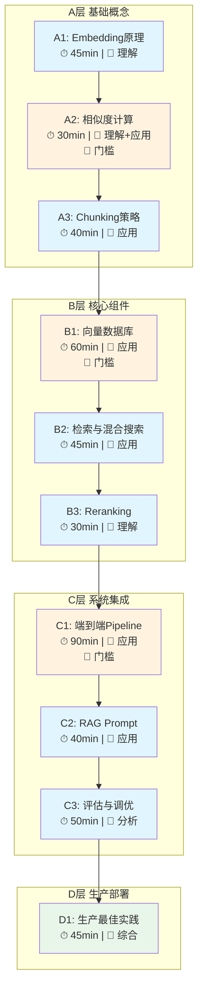

# RAG与向量数据库 学习路径

> **前测结果**：从零开始  
> **学习范围**：全覆盖（原理层 + 实践层 + 生产层）  
> **预计节点**：10个核心节点

---

## 🗺️ 学习路径图

**图例**：🚧 = 门槛概念（需要更多验证）| 橙色 = 门槛节点 | 蓝色 = 普通节点 | 绿色 = 综合应用

---

## 📋 节点详情

### A层：基础概念 (Foundation)

| 节点 | 名称 | 预计时长 | 认知层次 | 门槛 | 前置 |
|------|------|----------|----------|------|------|
| A1 | Embedding原理与向量空间 | 45min | 理解 | - | 无 |
| A2 | 相似度计算与ANN算法 | 30min | 理解+应用 | 🚧 | A1 |
| A3 | Chunking分块策略 | 40min | 应用 | - | A2 |

**A1 核心内容**：
- 什么是Embedding？文本如何变成向量？
- 向量空间的几何直觉（高维空间中的"距离"）
- 主流Embedding模型对比

**A2 核心内容**（🚧门槛）：
- 余弦相似度 vs 欧氏距离 vs 点积
- 为什么需要ANN？暴力搜索的复杂度问题
- HNSW、IVF等索引算法的直觉理解

**A3 核心内容**：
- 固定长度 vs 语义 vs 递归分块
- Chunk大小与Overlap的权衡
- 实操：对一篇文档实施不同分块策略

---

### B层：核心组件 (Core Components)

| 节点 | 名称 | 预计时长 | 认知层次 | 门槛 | 前置 |
|------|------|----------|----------|------|------|
| B1 | 向量数据库选型与实践 | 60min | 应用 | 🚧 | A3 |
| B2 | 检索策略与混合搜索 | 45min | 应用 | - | B1 |
| B3 | Reranking重排序 | 30min | 理解 | - | B2 |

**B1 核心内容**（🚧门槛）：
- Chroma本地实操（创建、插入、查询）
- 向量数据库核心概念：Collection、Index、Metadata
- Pinecone/Milvus/Weaviate 对比决策

**B2 核心内容**：
- Dense vs Sparse检索
- 混合搜索的融合策略（RRF、加权求和）
- 元数据过滤的应用场景

**B3 核心内容**：
- 为什么需要二次排序？
- Cross-encoder vs Bi-encoder
- Cohere Rerank实操

---

### C层：系统集成 (Integration)

| 节点 | 名称 | 预计时长 | 认知层次 | 门槛 | 前置 |
|------|------|----------|----------|------|------|
| C1 | 端到端RAG Pipeline | 90min | 应用 | 🚧 | B3 |
| C2 | Prompt Engineering for RAG | 40min | 应用 | - | C1 |
| C3 | 评估与调优 | 50min | 分析 | - | C2 |

**C1 核心内容**（🚧门槛）：
- 用LangChain/LlamaIndex搭建完整RAG
- 文档加载 → 分块 → Embedding → 存储 → 检索 → 生成
- 调试：检索结果不相关时怎么排查？

**C2 核心内容**：
- RAG专用Prompt模板设计
- 如何让LLM承认"资料中没有"
- 多文档综合时的引用格式

**C3 核心内容**：
- RAG评估指标：Recall、Precision、NDCG
- RAGAS评估框架
- 常见问题归因（是检索问题还是生成问题？）

---

### D层：生产部署 (Production)

| 节点 | 名称 | 预计时长 | 认知层次 | 门槛 | 前置 |
|------|------|----------|----------|------|------|
| D1 | 生产部署最佳实践 | 45min | 综合 | - | C3 |

**D1 核心内容**：
- 知识库更新策略（增量 vs 全量）
- 缓存与性能优化
- 监控与可观测性
- 成本控制（Embedding调用、LLM调用）

---

## 🚧 门槛概念说明

| 节点 | 为什么是门槛 | 跨不过的后果 |
|------|-------------|--------------|
| A2 | 不理解相似度计算，后续所有检索优化都是黑箱 | 无法判断检索结果好坏 |
| B1 | 不会操作向量数据库，无法动手实践 | 停留在理论层面 |
| C1 | 不能端到端跑通，无法形成完整认知 | 碎片化知识，无法解决实际问题 |

---

## ⏱️ 时间预估

| 层级 | 节点数 | 总时长 |
|------|--------|--------|
| A层 基础概念 | 3 | 115min |
| B层 核心组件 | 3 | 135min |
| C层 系统集成 | 3 | 180min |
| D层 生产部署 | 1 | 45min |
| **总计** | **10** | **~8小时** |

---

## 🎮 学习策略建议

基于你的兴趣图谱（RTS/即时战略），推荐类比：

> **RAG就像星际争霸的侦察系统**：
> - **Embedding** = 把敌人单位转化为"威胁值向量"
> - **向量数据库** = 战场迷雾下的情报存储
> - **检索** = 根据当前战局快速调取相关情报
> - **生成** = 基于情报做出战术决策

学习节奏建议：
1. **先跑通再理解**：A层快速过，B1实操优先
2. **门槛概念多花时间**：A2、B1、C1 需要费曼验证
3. **边学边做**：每个节点都有实操任务

---

**下一步**：从 A1 (Embedding原理) 开始？
